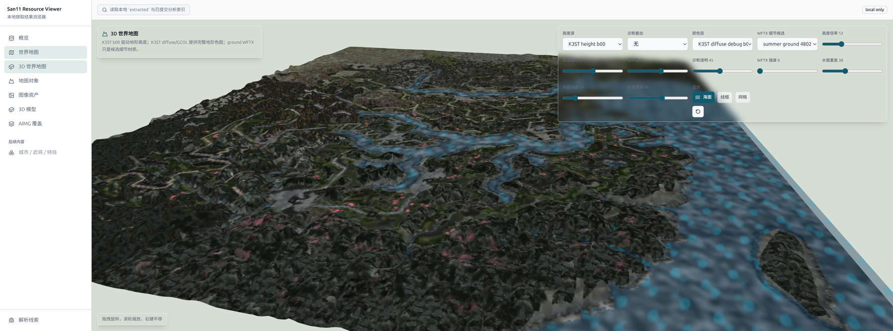

# San11 Resource Viewer

本目录是本地资源浏览器。它按游戏内容组织页面，而不是按提取输出目录组织页面：

- 世界地图：SHEX 字段图层、组合预览、runtime grid 线索。
- 3D 世界地图：K3ST 高度场、K3ST/GCOL 全图地表色图、海面和 WFTX 细节候选。
- 地图对象：object_type、shadow 候选名、对象坐标分布。
- 资产库：头像、WFTX 贴图、WKMD 模型、AIMG 覆盖层。
- 解析线索：覆盖率、签名、结构字段，仅作为辅助来源。

运行：

```bash
cd viewer
npm install
npm run dev -- --host 127.0.0.1
```

常用页面：

```text
http://localhost:5173/map/3d
```

如果端口被占用，以 Vite 输出的实际地址为准。

## 3D 世界地图说明



默认配置用于检查当前最可信的地形渲染路径：

- `高度源`：默认 `K3ST height b00`，固定全图直采。
- `颜色层`：默认 `K3ST diffuse debug b01/b02/b03`，这张 1025x1025 全图更接近原始地表底图；四季 `GCOL` 可用于对比。
- `WFTX 细节候选`：默认强度 `0`。`ground_*.wft` 当前只作为候选细节材质，不当作主地图 tile。
- `海面`：默认开启。
- `网格`：默认关闭，需要对齐格子时手动打开。
- `诊断叠加`：用于叠加 K3ST/aux/derived 调试层。

浏览器只读取已经生成的本地文件：

- `extracted/manifests/*.json`
- `extracted/faces/`
- `extracted/resources/`
- `extracted/models/`
- `extracted/maps/`
- `extracted/aimg/`
- `extractor/ida/data/resource_hints/`

它不直接解析原始游戏文件、IDB 或压缩包。二进制解析应放在 Python 提取层完成。
